 

<a href="mailto:mithilcuber@gmail.com">Email</a> ·
<a href="https://www.linkedin.com/in/mithilesh-a-07486935b/">LinkedIn</a> ·
<a href="https://github.com/Mithil-7">GitHub</a> ·
<a href="https://stackexchange.com/users/36784600/mithil-a">Stack Exchange</a> ·
<a href="https://www.freelancer.in/u/Mithil7a">Freelancer</a>

  

  

 

## `whoami`

B.Tech student in Computer Science Engineering (AI & DS) at **SASTRA Deemed University**, Thanjavur — based in Hosur, India. I sit at the intersection of **reinforcement learning, deep learning, and quantitative finance**, currently building DNN‑RL hybrid models that forecast exchange rates using macroeconomic signals: crude oil, gold futures, and the NIFTY 50.

Alongside research, I build full-stack AI applications, compete in national hackathons, and dig into network security and multi-agent systems whenever a good problem shows up.

<table>
<tr>
<td width="50%" valign="top">

**🎓 Education**
- B.Tech CSE (AI & DS), SASTRA Deemed University — 2024–2028
- CS50W, Harvard University — *in progress*
- Financial Markets Certification, Yale (Coursera) — *completed*

</td>
<td width="50%" valign="top">

**📍 Currently**
- Researching DNN‑RL exchange rate forecasting → IEEE target
- Researching APT detection using ML for network security
- Consulting on alpha research at WorldQuant BRAIN

</td>
</tr>
</table>

 

## `ps aux | grep research`

<table>
<tr>
<td width="50%" valign="top">

### 📈 Exchange Rate Forecasting
**Mar 2026 – Present · SASTRA Deemed University**

DNN‑RL hybrid model combining deep neural networks with PPO policy-gradient reinforcement learning to augment time-series forecasting. Incorporates crude oil, gold futures, and NIFTY 50 as macroeconomic signals.

`PPO` `Deep Learning` `Time Series` `IEEE Target`

**Result: 95%+ predictive accuracy**

</td>
<td width="50%" valign="top">

### 🔐 APT Detection
**Feb 2026 – Present · SASTRA Deemed University**

Investigating Advanced Persistent Threat detection and anomaly identification with ML, aimed at enterprise-grade network security frameworks against long-term, sophisticated threat actors.

`Anomaly Detection` `Network Security` `ML`

**Status: active research**

</td>
</tr>
</table>

 

## `cat skills.json`

<table>
<tr><td><b>🧠 AI / RL / Deep Learning</b></td><td>

</td></tr>
<tr><td><b>💬 NLP / LLM</b></td><td>

</td></tr>
<tr><td><b>👁️ Computer Vision</b></td><td>

</td></tr>
<tr><td><b>💻 Languages</b></td><td>

</td></tr>
<tr><td><b>🌐 Web / Full Stack</b></td><td>

</td></tr>
<tr><td><b>📊 Data Science</b></td><td>

</td></tr>
<tr><td><b>📈 Quant Finance</b></td><td>

</td></tr>
<tr><td><b>🔧 Tools / Systems</b></td><td>

</td></tr>
</table>

 

## `tail -f experience.log`

**BRAIN Research Consultant · WorldQuant** — *May 2026 – Present*
Developing quantitative alphas on WorldQuant's BRAIN platform, applying probability theory and statistical modeling to construct and backtest financial signal strategies across global markets.

**Freelance AI/ML Developer · Freelancer.in** — *2026 – Present*
Delivering custom AI/ML solutions and full-stack apps; building end-to-end data pipelines, training workflows, and deployment-ready APIs on the Django/Python stack.

**Student Researcher · SASTRA Deemed University** — *Feb 2026 – Present*
DNN-RL exchange rate forecasting and APT detection research, both tracked toward publication.

 

## `ls projects/`

| Project | Description | Stack |
|---|---|---|
| **RL-Based Traffic Management** *(SIH 2025)* | Multi-agent RL traffic-signal control minimizing clearance time across intersections; OpenCV on Raspberry Pi for real-time vehicle detection | `DQN` `MARL` `OpenCV` `Raspberry Pi` |
| **Exchange Rate Forecasting Engine** | DNN + PPO reinforcement learning agents on multivariate financial time series (crude oil, gold, index data) — 95%+ accuracy | `TensorFlow` `PPO` `Time Series` |
| **Web-Based AI Applications** | Full-stack platforms with AI/ML-backed features, end-to-end from data pipeline to UI | `Django` `MongoDB` `JavaScript` |

<a href="https://github.com/Mithil-7?tab=repositories">→ all repos on GitHub</a>

 

## `git log --stat`

 

## `cat achievements.txt`

🥇 **CMI STEMS Top 30 India** — Chennai Mathematical Institute, research aptitude · 2025
📝 **IEEE Research Paper (in progress)** — DNN-RL exchange rate prediction · 2026 target
🚦 **Smart India Hackathon 2025** — RL-based intelligent traffic management, Odisha
🏛️ **NPTEL SWAYAM** — Deep Learning: architectures, backprop & optimization · 2026
📊 **Yale (Coursera)** — Financial Markets, market theory & quant finance
🌐 **Harvard CS50W** — Web Programming with Python & JavaScript · in progress
➗ **Mathematics Olympiad** — IOQM qualifier, merit certificate holder

 

## `> ping mithil`

Open to research collaborations, internships, freelance work, and conversations about AI, quant finance, or anything at the edge of both.

**[mithilcuber@gmail.com](mailto:mithilcuber@gmail.com)** · **[LinkedIn](https://www.linkedin.com/in/mithilesh-a-07486935b/)** · **[GitHub](https://github.com/Mithil-7)** · **[Freelancer](https://www.freelancer.in/u/Mithil7a)**

© 2026 Mithilesh Adhinarayanan · Hosur, India · built with a bit too much PPO

