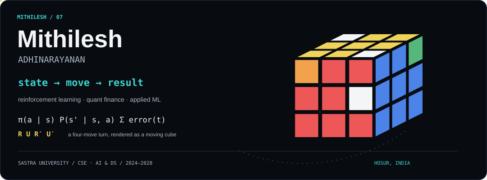
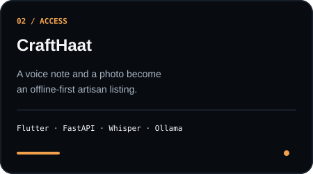
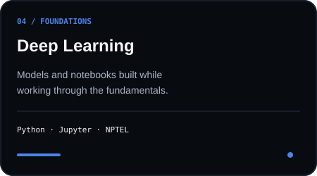
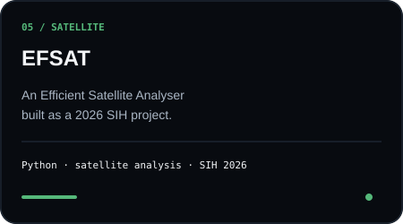
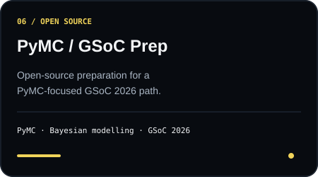
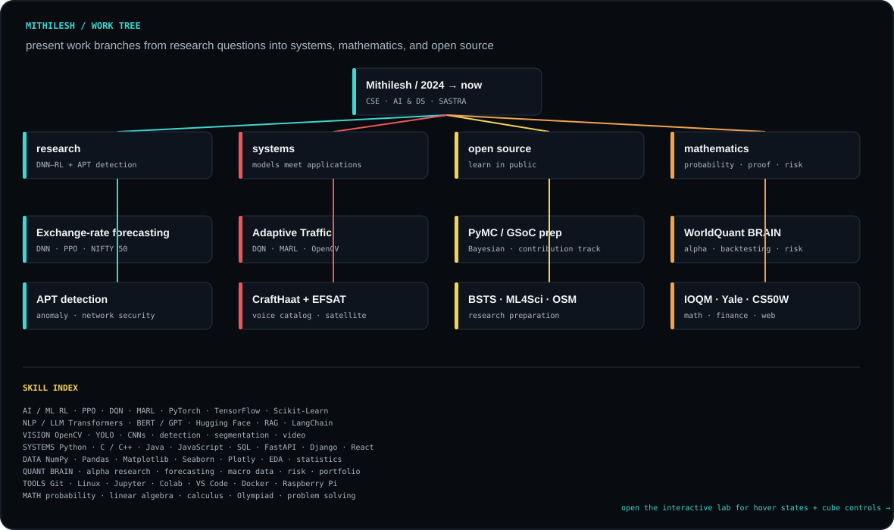

<div align="center">

<a href="https://github.com/Mithil-7">
  
</a>

<a href="https://mithil-7.github.io/interactive-lab.html"><b>Open the playable cube + hoverable work tree →</b></a>

<br />

**Mithilesh Adhinarayanan**  
`CSE · AI & DS` &nbsp; `SASTRA University` &nbsp; `Hosur, India`

[GitHub](https://github.com/Mithil-7) · [Portfolio](https://mithil-7.github.io/) · [LinkedIn](https://www.linkedin.com/in/mithilesh-a-07486935b/) · [Email](mailto:mithilcuber@gmail.com)

</div>

---

## The idea

I like problems with a state, a move, and a measurable result.

The Rubik's cube is a useful model for that:

```text
state ── move ──> new state
  │                 │
  └── constraint ───┘
```

In code, that becomes reinforcement learning, data remediation, traffic control, forecasting, and the mathematics behind a decision.

```text
π(a | s)        choose an action from a state
P(s' | s, a)    model the next state
Σ error(t)      measure what needs fixing
```

## What I work on

| Direction | Current focus |
| :--- | :--- |
| **Reinforcement learning** | PPO, DQN, multi-agent control, sequential decisions |
| **Quantitative finance** | Time series, alpha research, risk, portfolio optimisation |
| **Applied ML** | Network anomaly detection, computer vision, data quality |
| **Systems** | Python APIs, dashboards, mobile apps, edge and data pipelines |

## Selected projects

<p align="center">
  <a href="https://github.com/Mithil-7/RL-Based-Traffic-Management-System"></a>
  <a href="https://github.com/Mithil-7/CraaftHaat"></a>
</p>
<p align="center">
  <a href="https://github.com/Mithil-7/Open_Env-Exchange_rate"></a>
  <a href="https://github.com/Mithil-7/DL--nptel-learning-projects"></a>
</p>
<p align="center">
  <a href="https://github.com/Mithil-7/EFSAT"></a>
  <a href="https://github.com/Mithil-7/GSoC-2026-PyMC-Preparation"></a>
</p>

| Repository | Short description |
| :--- | :--- |
| [**Adaptive Traffic Management**](https://github.com/Mithil-7/RL-Based-Traffic-Management-System) | A multi-agent traffic platform with computer-vision telemetry, DQN signal control, emergency preemption, routing, MQTT, and a safety layer that learned policies cannot override. Built from the SIH 2025 idea. |
| [**CraftHaat**](https://github.com/Mithil-7/CraaftHaat) | An offline-first Flutter + FastAPI prototype for artisan listings from a voice note and a photo, with speech, image, catalog, and ONDC preparation steps. |
| [**Exchange Rate OpenEnv**](https://github.com/Mithil-7/Open_Env-Exchange_rate) | An agent environment for deciding what to do with missing, spiking, or stale exchange-rate observations. |
| [**Deep Learning Projects**](https://github.com/Mithil-7/DL--nptel-learning-projects) | Foundational models and notebooks from deep-learning coursework. |
| [**EFSAT**](https://github.com/Mithil-7/EFSAT) | Efficient Satellite Analyser project for SIH 2026. |
| [**PyMC / GSoC Preparation**](https://github.com/Mithil-7/GSoC-2026-PyMC-Preparation) | Preparation and open-source contribution track for a PyMC-focused GSoC 2026 path. |

More original repositories: [Amazon ML Challenge](https://github.com/Mithil-7/Amazon_ML-challenge) · [Data Science Projects](https://github.com/Mithil-7/Data-Science-projects) · [BSTS](https://github.com/Mithil-7/BSTS) · [OSM Closure Routing PoC](https://github.com/Mithil-7/OSM-Closure-Routing-PoC) · [ML4Sci prep](https://github.com/Mithil-7/ML4Sci-prep) · [Prep](https://github.com/Mithil-7/Prep) · [Portfolio source](https://github.com/Mithil-7/Mithil-7.github.io)

The profile also contains forks used for learning and exploration; they are intentionally not labelled as projects created by me.

## Research notes

### Exchange-rate forecasting

Working on a DNN + PPO approach to financial time series using macroeconomic signals such as crude oil, gold futures, and NIFTY 50.

`DNN` `PPO` `time series` `quant finance`

### Network security

Investigating anomaly detection for Advanced Persistent Threat activity.

`ML` `network security` `anomaly detection`

Both are active research directions. The IEEE publication is a target, not a published result.

## Tools

| Branch | Skills |
| :--- | :--- |
| **AI / ML / deep learning** | Reinforcement Learning · Deep Learning · PPO · DQN · MARL · Neural Networks · Policy Gradient · TensorFlow · PyTorch · Keras · Scikit-Learn · Backpropagation · Time Series · Transfer Learning · Model Optimisation |
| **NLP / LLM** | Natural Language Processing · Large Language Models · Transformers · BERT / GPT architectures · Hugging Face · Text Classification · Sentiment Analysis · Tokenisation · Embeddings · Prompt Engineering · RAG · LangChain |
| **Computer vision** | OpenCV · YOLO · CNNs · Object Detection · Image Classification · Image Segmentation · Real-time Video Processing · Feature Extraction · Vehicle Detection |
| **Languages** | Python · Java / Swing · C++ · C · SQL · JavaScript |
| **Web / full stack** | Django · Streamlit · Flask · FastAPI · React · HTML / CSS · MongoDB · REST APIs |
| **Data / analytics** | NumPy · Pandas · Matplotlib · Seaborn · Plotly · Feature Engineering · Data Cleaning · Statistical Analysis · EDA · Data Visualisation |
| **Quantitative finance** | WorldQuant BRAIN · Custom Expression Languages · Algorithmic Trading · Alpha Research · Financial Forecasting · Exchange-rate Modelling · Macroeconomic Analysis · Risk Analysis · Portfolio Optimisation · Backtesting · Probability |
| **Tools / systems** | High Performance Computing · Git / GitHub · Linux · Jupyter Notebook · Google Colab · VS Code · Docker · Raspberry Pi · DSA · APT Detection · Anomaly Detection · Network Security |
| **Mathematics** | Probability Theory · Linear Algebra · Calculus · Olympiad Mathematics · Physics · Statistical Modelling · Problem Solving |

## Timeline

- **2026–present** — BRAIN Research Consultant, WorldQuant
- **2026–present** — Freelance AI/ML developer
- **2026–present** — Student researcher, SASTRA Deemed University
- **2025** — CMI STEMS Top 30 India
- **2025** — Smart India Hackathon project: intelligent traffic management
- **IOQM** — Qualifier and merit certificate holder
- **Yale / Coursera** — Financial Markets certification

## Work tree

<p align="center">
  <a href="https://mithil-7.github.io/interactive-lab.html">
    
  </a>
</p>

The full tree has hover highlighting in the interactive lab. The README version is deliberately static because GitHub strips JavaScript from profile READMEs.

## Contributions, as a 3D field

<p align="center">
  <a href="https://github.com/Mithil-7?tab=overview">
    
  </a>
</p>

The graph is generated from GitHub's contribution calendar and refreshed daily by GitHub Actions. It is not a hand-drawn activity claim.

---

<div align="center">

**Research collaborations · internships · freelance AI/ML work**

[Start a conversation](mailto:mithilcuber@gmail.com)

</div>
